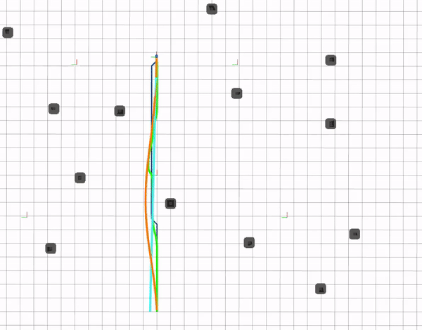
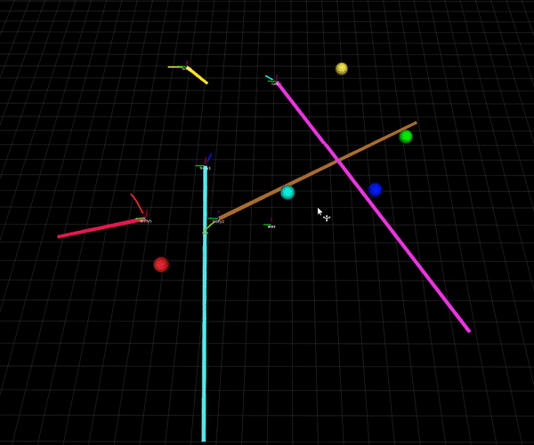

# NEPTUNE: Non-Entangling Trajectory Planning for Multiple Tethered Unmanned Vehicles #
### **Accepted for publication in the IEEE Transactions on Robotics (T-RO)**

A trajectory planning framework for multiple tethered robots. It also works for multiple untethered robots, with a simple change of a parameter (set `enable_entangle_check` to False).
### 


## Citation

If you find this package useful, please cite [NEPTUNE: Non-Entangling Planning for Multiple Tethered Unmanned Vehicles](https://arxiv.org/abs/2212.01536) ([pdf](https://arxiv.org/abs/2212.01536), [video](https://youtu.be/8b1RlDvQsi0)):

```bibtex
@article{cao2023neptune,
  title={NEPTUNE: Non-Entangling Planning for Multiple Tethered Unmanned Vehicles},
  author={Cao, Muqing and Cao, Kun and Yuan, Shenghai and Nguyen, Thien-Minh and Xie, Lihua},
  journal={IEEE Transactions on Robotics},
  year={2023},
  publisher={IEEE}
}
```

## General Setup

NEPTUNE has been tested with Ubuntu 16.04/ROS Kinetic and Ubuntu 18.04/ROS Melodic

This package requires [Gurobi Optimizer](https://www.gurobi.com/products/gurobi-optimizer/) (free academic lisence available). You can test your installation typing `gurobi.sh` in the terminal.

Install some necessary libraries:

```bash
sudo apt-get install libgmp3-dev libmpfr-dev tmux xterm -y   
```
Install CGAL library:

```bash
mkdir -p ~/library/cgal #this command creates a folader named library in your home directory
#alternatively you can use another location
cd ~/library/cgal
wget https://github.com/CGAL/cgal/releases/download/releases%2FCGAL-4.14.2/CGAL-4.14.2.tar.xz
tar -xf CGAL-4.14.2.tar.xz
cd CGAL-4.14.2/
cmake . -DCMAKE_BUILD_TYPE=Release
sudo make install   
```

Create a workspace and clone NEPTUNE and its submodules:

```bash
cd ~/ && mkdir catkin_ws_neptune && cd catkin_ws_neptune && mkdir src && cd src
git clone https://github.com/caomuqing/neptune.git
cd neptune && git submodule init && git submodule update
```

Build the packages:

```bash
cd ~/catkin_ws_neptune
rosdep install --from-paths src --ignore-src -r -y
catkin config -DCMAKE_BUILD_TYPE=Release
catkin build
```

If catkin build results in error due to Gurobi:
```
“gurobi_continuous.cpp:(.text.startup+0x74): undefined reference to
`GRBModel::set(GRB_StringAttr, std::__cxx11::basic_string<char,
std::char_traits<char>, std::allocator<char> > const&)'”
```
The solution is:

```bash
cd /opt/gurobi912/linux64/src/build  #the location depends on your installation directory
sudo make
sudo cp libgurobi_c++.a ../../lib/
```

## Running Simulations

### Single-agent


To launch:
```
cd ~/catkin_ws_neptune && bash src/neptune/neptune_single_benchmark.sh
```
To shut down all processes, use the shutdown [commands](#cleanly-shut-down-simulation)


### Multi-agent obstacle-free



The command below launches 5 robots with random goals automatically sent to them. It is best if your PC has more than 5 CPU cores.

```
cd ~/catkin_ws_neptune && bash src/neptune/neptune_mtlp_benchmark.sh
```
To shut down all processes, use the shutdown [commands](#cleanly-shut-down-simulation)

### Multi-agent obstacle-rich


To launch:
```
cd ~/catkin_ws_neptune && bash src/neptune/neptune_multi_obstacle.sh
```

### Multi-agent simulation with Unity and AGX Dynamics
This simulation requires a windows computer running Unity with the AGX Dynamics plugin (request trial [here](https://www.algoryx.se/agx-unity/)), and a Unbuntu computer having followed the [general setup](#general-setup) above. Two computers are connected using a LAN cable (read [ROS-Unity integration](https://github.com/Unity-Technologies/Unity-Robotics-Hub/blob/main/tutorials/ros_unity_integration/README.md) for more setup details).

The unity package containing the scenes with our tethered drone models is [here](https://drive.google.com/file/d/1VJBm-ERsw9e6_UiGV-W3uzLhE_lfuD_O/view?usp=sharing). Before importing the package to Unity, you should have imported the AGX Dynamic package and [ROS-TCP-Connector](https://github.com/Unity-Technologies/ROS-TCP-Connector).
For the Unbuntu machine, you will additionally need ROS packages [tcc](https://github.com/caomuqing/tcc), [mav_control_rw](https://github.com/caomuqing/mav_control_rw) and [ROS-TCP-Endpoint](https://github.com/Unity-Technologies/ROS-TCP-Endpoint) in the same workspace as NEPTUNE. The IP addresses on the ROS side and Unity side have to be configured according to your machines' IPs.

To launch:
```
cd ~/catkin_ws_neptune && bash src/neptune/neptune_multi_unity.sh
```

### Cleanly shut down simulation:
```
rosnode kill -a
tmux kill-server
killall xterm
```
## Known Issues

We are looking into a bug that will cause the planning node to crash occasionally.


## Credits:
This package uses some existing functions and unilities from [MADER](https://github.com/mit-acl/mader), such as trajectory messages, cgal unilities and parameter class.

This package uses some C++ classes from the [DecompROS](https://github.com/sikang/DecompROS) repo (included in the `thirdparty` folder).


---------
