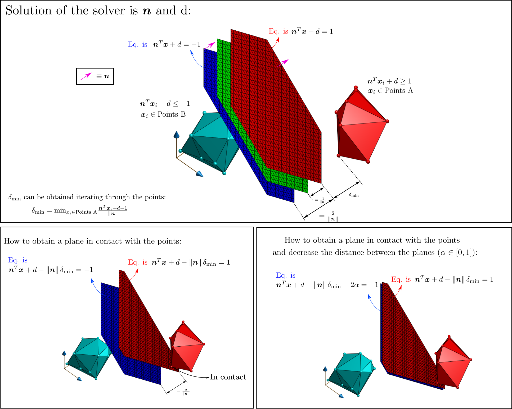

Separator Library
========================

 

This library allows you to solve the Linear Program to obtain the plane that separates two sets of points in 3D. Unfeasibility of the problem means that the two sets of points are not linearly separable. Note that this library simply finds **one** of the possible planes that separate the two sets of points (i.e. it does not optimize the distance as in the [SVM problem](https://en.wikipedia.org/wiki/Support_vector_machine)).

One possible application of this library is to test if two polyhedra are in collision or not (by simply checking if the LP problem that separates theirs vertexes is feasible or not). In case of feasibility, a plane that separates these polyhedra will also be returned

## Citation

When using this library, please cite [MADER: Trajectory Planner in Multi-Agent and Dynamic Environments](https://arxiv.org/abs/2010.11061):

```bibtex
@article{tordesillas2020mader,
  title={{MADER}: Trajectory Planner in Multi-Agent and Dynamic Environments},
  author={Tordesillas, Jesus and How, Jonathan P},
  journal={arXiv preprint},
  year={2020}
}
```

## Available solvers
You can compile this library either with [Gurobi](https://www.gurobi.com/products/gurobi-optimizer/) or with [GLPK](https://www.gnu.org/software/glpk/) by simply changing the option `USE_GLPK` in the `CMakeList.txt`:
* If you set `USE_GLPK` to `ON` (the default option), the [GLPK](https://www.gnu.org/software/glpk/) solver will be used, and, if not currently installed, it will be downloaded and installed automatically in your computer. 
* If you set `USE_GLPK` to `OFF`, you need to have the [Gurobi Optimizer](https://www.gurobi.com/products/gurobi-optimizer/) installed beforehand (you can check that it is properly installed by typing `gurobi.sh` in the terminal). Have a look at [this section](#issues-when-installing-gurobi) if you have any issues during the installation/compilation.

*Which solver is faster?* It depends on the exact problem you want to solve. For the kind of LPs solved in [MADER](https://github.com/mit-acl/mader), GLPK runs faster. 

## Instructions

```
mkdir ws && cd ws && mkdir src && cd src
git clone https://github.com/mit-acl/separator.git
cd ..
catkin config -DCMAKE_BUILD_TYPE=Release
catkin build
```

The backened solver [GLPK](https://www.gnu.org/software/glpk/) will be downloaded and installed when executing `catkin build` ( You can also install int manually by following the instructions located [here](https://en.wikibooks.org/wiki/GLPK/Linux_OS#Install)). The GLPK Reference Manual (and its API documentation) is available [here](http://www.chiark.greenend.org.uk/doc/glpk-doc/glpk.pdf).

## Sample Usage in another ROS package

In its CMakeLists.txt add the library name to `find_package()`.

```cmake
find_package(catkin REQUIRED COMPONENTS separator)
```

Example: see test_separator.cpp

## Details
The reason behind the two planes (instead of only the green one) is that we want to avoid using the "epsilon" in the > or < constrains (more details [here](https://www.joyofdata.de/blog/testing-linear-separability-linear-programming-r-glpk/#crayon-5fabe3cf5c0d3782979776:~:text=The%20conditions%20of%20a%20linear%20program,lets%20transform%20(1)%20and%20(2)%20appropriately%3A))
 

## Issues when installing Gurobi:

If you find the error:
```
“gurobi_continuous.cpp:(.text.startup+0x74): undefined reference to
`GRBModel::set(GRB_StringAttr, std::__cxx11::basic_string<char,
std::char_traits<char>, std::allocator<char> > const&)'”
```
The solution is:

```bash
cd /opt/gurobi800/linux64/src/build  #Note that the name of the folder gurobi800 changes according to the Gurobi version
sudo make
sudo cp libgurobi_c++.a ../../lib/
```

## Credits
Part of the code is based on the ACL [motoralloc library](https://gitlab.com/mit-acl/creare-labdrone/motoralloc).
